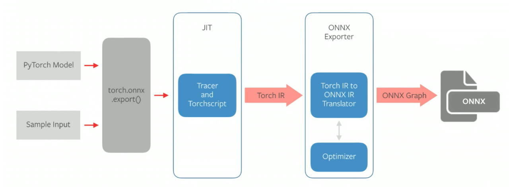

# ONNX (Open Neural Network Exchange)
[](https://github.com/onnx/onnx)

Tensorflow, PyTorch 와 같은, 서로 다른 DNN 프레임워크 환경에서 만들어진 모델들을,서로 호환해서 사용할 수 있도록 도와주는 공유 플랫폼




1. PyTorch model, sample input $\rightarrow$ ```torch.onnx.export()```
2. PyTorch 의 just in time(JIT) 컴파일러를 통해서, Trace 혹은 Script 를 생성
3. PyTorch 모델의 forward propagation 시에 호출되는, 함수 및 연산들에 대한 최적화된 그래프인 Torch IR 을 만듦
   - [Torch intermediate representation(IR)](https://github.com/pytorch/pytorch/wiki/PyTorch-IR)
     - SSA-based compiler (Static single-assignment form)
4. Trace나 Script 는, PyTorch 의 nn.Module 을 상속하는 모델의, forward 함수에서 실행되는 코드들에 대한 IR(Intermediate Representation)을 담고 있음
5. 생성된 trace / script (Torch IR)는, ONNX Exporter 를 통해서 ONNX IR 로 변환되고,여기에서 한 번 더 Graph Optimization 이 이루어짐
6.  .onnx 포맷으로 저장


- Trace와 Script의 장단점
  - Tracing
    - 장점: Script와 비교했을 때 type 추정으로 인한 문제, Python primitive와의 호환성 문제가 적다.
    - 단점: forward를 한 번 수행하는 동안 거쳐간 execution path에 대해서 그래프가 statically fix 되기 때문에 dynamic control flow를 살리지 못한다
  - Scripting
    - 장점: C, Java와 같이 전체 코드를 보고 컴파일을 하기 때문에 dynamic control flow를 살릴 수 있다.
    - 단점: 지원하지 않는 파이썬 코드들이 상당히 많고, type 추정, 중간에 attribute이 변하는 경우 등에 문제가 생긴다.


## ```onnx.export``` format 
```python
torch.onnx.export(torch_model,                  # 실행될 모델
                x,                              # 모델 입력값 (튜플 또는 여러 입력값들도 가능)
                "super_resolution.onnx",        # 모델 저장 경로 (파일 또는 파일과 유사한 객체 모두 가능)
                export_params = True,           # 모델 파일 안에 학습된 모델 가중치를 저장할지의 여부
                opset_version = 10,             # 모델을 변환할 때 사용할 ONNX 버전
                do_constant_folding = True,     # 최적화시 상수폴딩을 사용할지의 여부
                input_names =   ['input'],      # 모델의 입력값을 가리키는 이름
                output_names =  ['output'],     # 모델의 출력값을 가리키는 이름
                dynamic_axes =  {'input' : {0 : 'batch_size'},    # 가변적인 길이를 가진 차원
                                'output' : {0 : 'batch_size'}})
```


## Reference
- https://wooono.tistory.com/415